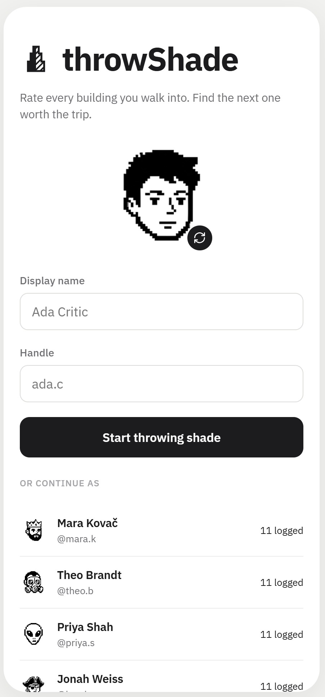
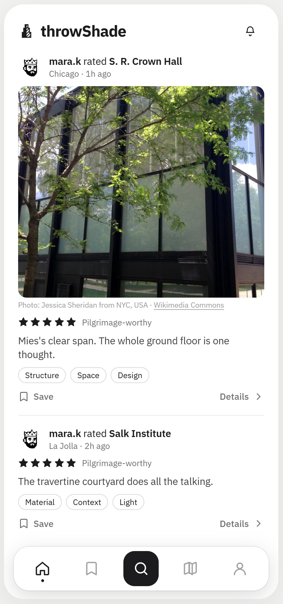
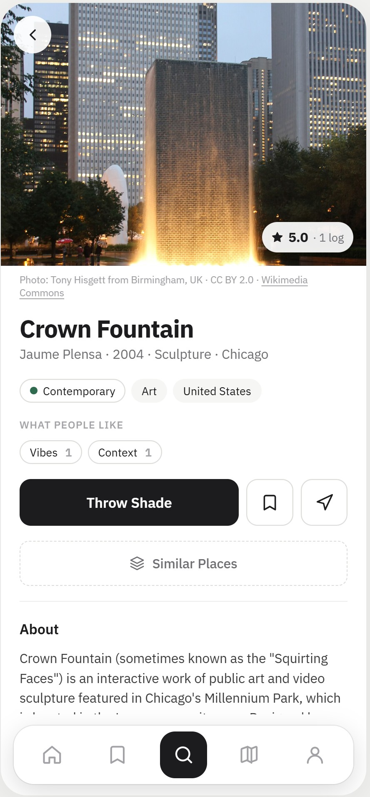
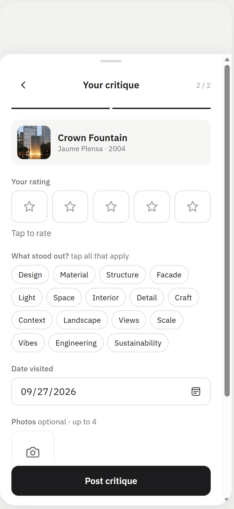
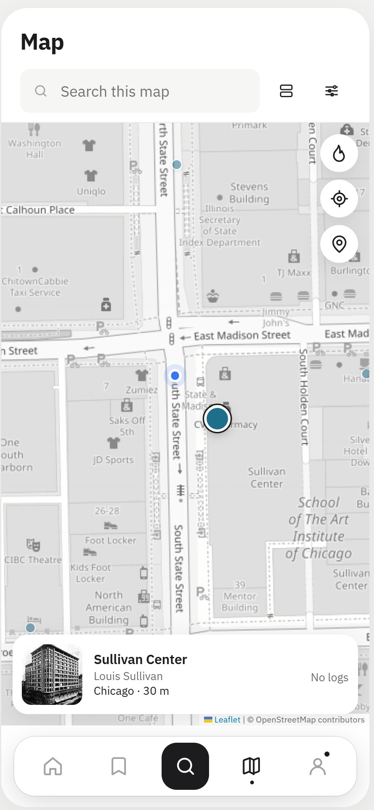
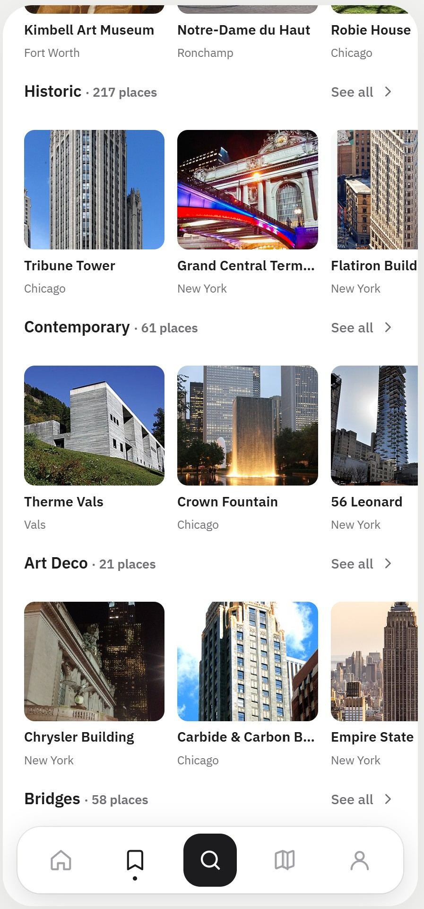

# throwShade

**Rate every building you walk into. Find the next one worth the trip.**

`throwShade` is Beli, but for architecture — a mobile app for logging, rating and sharing the buildings, bridges, art and public spaces you visit. No stock photos, no rankings algorithm, no ads: just what your friends actually thought of the places they've been.

`AEC Tech Chicago Hackathon 2026` · `no backend` · `no build step` · `568 real Chicago places`

## Why

Great buildings get seen once and forgotten. There's no Beli for architecture — no easy way to log an opinion on a building, see what your friends rated worth a detour, or find out a place is a Pritzker winner before you walk past it. throwShade is that layer: a personal log, a friends feed, and a map, backed by real open data instead of placeholder pins.

A hackathon demo: a phone-sized local web app with no backend, no build step and no App Store. Everything runs from a folder of static files and lives in your browser's `localStorage` — you could ship it from a USB stick.

See [SPEC.md](SPEC.md) for the full product spec and [`Throwing Shade — Screen Map.html`](<Throwing Shade — Screen Map.html>) for the original design mockups.

## Screens

| Sign in | Feed | Building |
| --- | --- | --- |
|  |  |  |

| Rate it | Map + filters | Discover |
| --- | --- | --- |
|  |  |  |

Sign in as one of the seeded critics, scroll a friends feed with trending places, tap into a building for its photo, rating, weather/golden-hour panel and critiques, throw shade with a star rating and tags, then filter the map by type, rating and style, or browse curated categories.

## Features

- **Log & rate** any building, bridge, artwork or public space, 1–5 stars, with notes, "what stood out" tags and up to 4 photos.
- **Feed** of friends' logs, with an Everyone / Following toggle and a Trending shelf (most-logged places in the last two weeks).
- **Map** with style-coloured pins, type/rating filters, and a heatmap toggle — drop a pin anywhere to look a building up on OpenStreetMap or name it yourself.
- **Search** with type, style and rating quick-filters, covering buildings, bridges, art and spots worldwide.
- **Lists** — a private Want to Visit list plus shareable custom lists with members, invites, sort-by-rating, and crawl planning between a list's places.
- **Profiles** with stats, badges, level/XP, streaks, and a "Where you've been" map.
- **Architect pages** — tap any architect's name to see everything of theirs in the app.
- **Comments and an activity feed** for follows, comments and friends logging places on your Want to Visit list.
- **Dark mode**, opt-in only, remembered per device.

## The loop

```
 Visit ──► Log + rate ──► Share to feed ──► Discover next
   ▲                                             │
   └────── saved to Want to Visit ◄──────────────┘
```

## Run it

```sh
cd app
python -m http.server 5173
```

Open http://localhost:5173 in Chrome. Press F12, then Ctrl+Shift+M for device mode, and pick a 390 × 844 phone (e.g. iPhone 12 Pro).

Opening `app/index.html` directly also works. The map needs internet (Leaflet and OpenStreetMap tiles).

To test on a real phone on the same Wi-Fi, open `http://<your-laptop-ip>:5173`. "Nearby" always sorts from `TS_DEMO_LOCATION` in `app/data.js` (the Chicago Loop) while `force: true` is set.

## Building data

- `app/data.js`: hand-picked landmarks worldwide, plus the seeded critics and their logs.
- `app/wikidata.js`: generated places with photos, credits and Wikipedia intros — Chicago-area buildings, bridges, art and spots, plus notable buildings worldwide. To regenerate it:
  ```sh
  # Chicago only
  python tools/fetch_wikidata.py --global 0 --local 400 --radius 20 --city Chicago

  # Chicago + worldwide landmarks
  python tools/fetch_wikidata.py --global 450 --local 400 --radius 20 --city Chicago
  ```
- **Pin** on the map, or a long-press, looks the spot up on OpenStreetMap (Overpass and Nominatim). Pick the building, or name it yourself, then rate it.

## Demo tips

- **You → Reset demo data** restores the seeded critics and clears your account.
- **You → Switch account** lets you sign in as @mara.k and show that your new log appears in her feed.
- Change `TS_DEMO_LOCATION` in `app/data.js` to the venue before recording.

## Files

| File | What |
| --- | --- |
| `app/index.html` | Shell |
| `app/styles.css` | Design tokens and components taken from the mockups |
| `app/app.js` | Routing, views, state (`localStorage`) |
| `app/data.js` | Hand-picked buildings, seeded critics, their logs, demo location |
| `app/wikidata.js` | Generated buildings, bridges, art and spots (don't edit by hand) |
| `tools/fetch_wikidata.py` | Wikidata/Wikipedia/Commons import script |
| `app/seed-photos.js` | Generated stand-in photos for seeded posts (don't edit by hand) |
| `tools/fetch_seed_photos.py` | Fetches those photos from Wikimedia Commons categories |
| `app/facts.js` | Generated landmark status, awards, Pritzker architects, access (don't edit by hand) |
| `tools/fetch_facts.py` | Fetches those facts from Wikidata and OpenStreetMap |
| `app/fonts/` | IBM Plex Sans (from the mockup bundle) |

## Built by

Built in a few hours at AEC Tech Chicago Hackathon 2026 by Herft, achyuth, eesha-on-jupiter, jckian and May1the1Forc1 — plus Claude.
